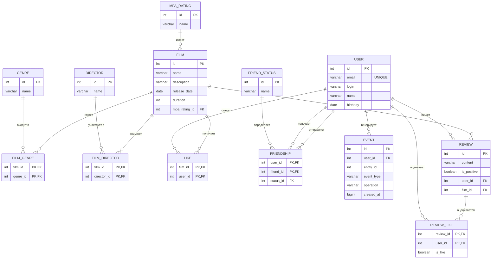

# java-filmorate

Бэкенд-сервис для оценки фильмов: пользователи добавляют фильмы, ставят лайки,
добавляют друг друга в друзья, пишут отзывы и получают рекомендации и ленту событий.

## Технологии

- Java 21, Spring Boot 3.5 (Web, Validation, JDBC)
- H2 Database (файловый режим по умолчанию, настраивается через `DB_URL`)
- Lombok, Checkstyle, Logbook (логирование HTTP)

## Запуск

```bash
mvn spring-boot:run
```

Схема БД (`schema.sql`) и справочные данные (`data.sql`) применяются автоматически при старте.

## Схема базы данных


